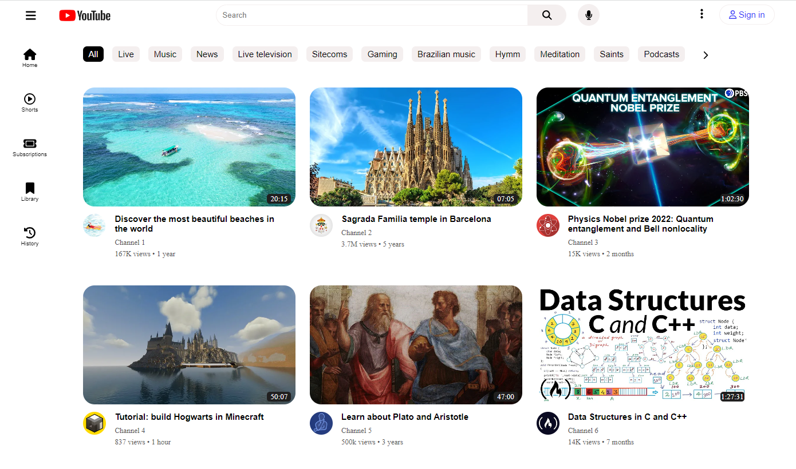

# Youtube-layout

This project is part of the HTML & CSS course in the [O Novo Programador](https://onovoprogramador.com/) programming school. The objective was to reproduce the layout of Youtube`s website using HTML and CSS.

Screenshot of the final result:

